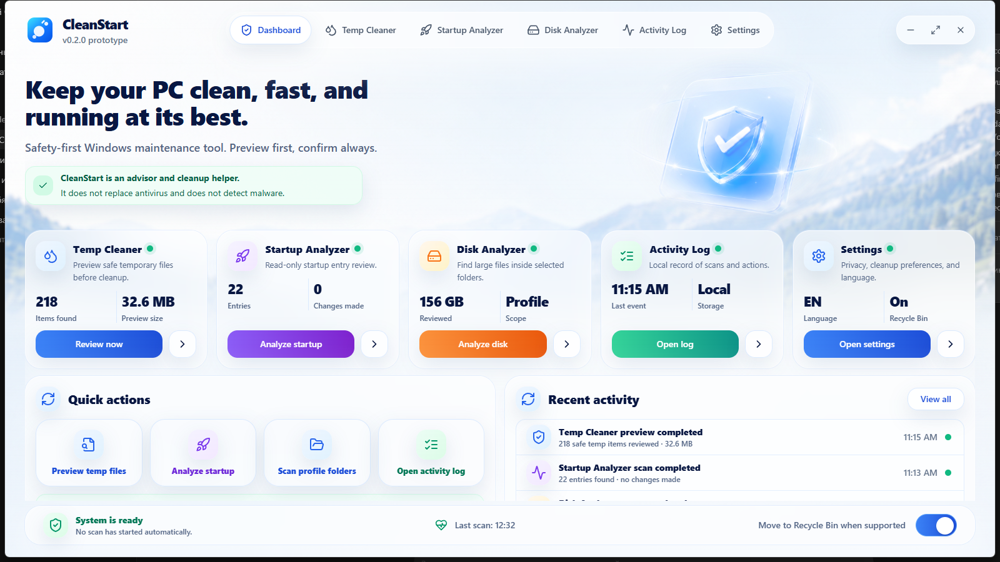
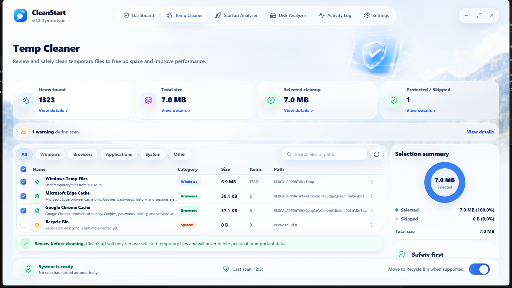
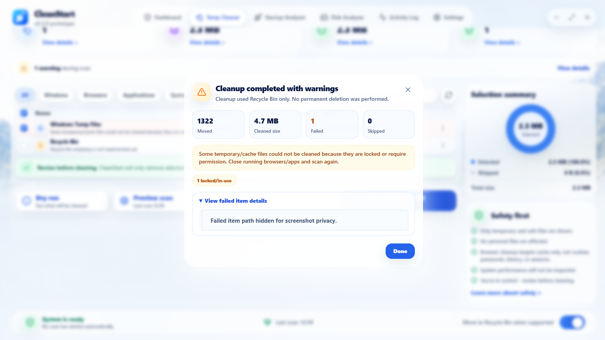

# CleanStart

CleanStart is an open-source, safety-first Windows maintenance app. It is built
to be transparent and realistic: preview first, explain what will happen, require
confirmation before cleanup, and avoid fake optimizer or antivirus claims.

The current main app is being developed with Tauri + React + TypeScript +
Tailwind, with a Rust backend for safety-critical cleanup validation. The older
PyQt6 MVP is preserved in `legacy-pyqt/` as the v0.1.0 reference.

## Why CleanStart Exists

Many cleanup tools use aggressive language, unclear deletion rules, or promises
they cannot honestly prove. CleanStart is built as a safer alternative: preview
first, explain what is being reviewed, require confirmation before real cleanup,
and avoid fake speed boost, scareware, registry cleaner, RAM booster, malware
removal, or antivirus claims.

## Current Version

`v0.2.0-alpha.1` adds a safety-first Temp Cleaner with real preview scan, dry
run, and selected cleanup through Recycle Bin for approved temporary folders and
browser cache locations.

This is still an alpha release:

- Temp Cleaner has real alpha cleanup behavior.
- Startup Analyzer and Disk Analyzer remain prototype screens.
- Activity Log and Settings are local/prototype state.
- Cleanup remains local-first with no login, telemetry, analytics, cloud sync,
  or external server calls.

## Feature Status

| Area | Status |
| --- | --- |
| Dashboard | Available UI with real navigation and local state. |
| Temp Cleaner | Real preview scan, dry run, selected cleanup through Recycle Bin, safe temp cleanup, browser cache cleanup for cache folders only. Alpha limitations apply. |
| Startup Analyzer | Prototype / not fully connected yet. |
| Disk Analyzer | Prototype / not fully connected yet. |
| Activity Log | Local/prototype entries. |
| Settings | Local/prototype settings. |

## Temp Cleaner Targets

CleanStart only scans approved temporary/cache locations:

- `%TEMP%`
- `%LOCALAPPDATA%\Temp`
- `C:\Windows\Temp` when accessible
- Microsoft Edge cache folders only
- Google Chrome cache folders only
- Brave cache folders only
- Firefox cache folders only

Approved root folders are not moved or deleted directly. CleanStart treats them
as cleanup groups, enumerates safe child files/folders inside them, skips
symlinks/reparse points/junctions, and moves selected accessible children to
Recycle Bin when supported.

## Browser Safety

Browser cleanup targets cache only.

CleanStart does not clean:

- cookies
- passwords
- history
- sessions
- autofill
- bookmarks

Some browser cache files may stay locked while the browser is running. Close the
browser and run Preview scan again to clean more cache files.

## Safety Principles

- Preview-first.
- Explicit confirmation before cleanup.
- Recycle Bin only.
- Permanent deletion is disabled.
- Rust backend validates selected cleanup paths.
- Personal folders are not targeted.
- Locked/protected files are skipped and reported.
- No automatic cleanup.
- No telemetry.
- No login or accounts.
- No cloud sync.
- No fake optimizer claims.
- No antivirus or malware-detection claims.

## Known Limitations

- Locked files may remain.
- Permission-protected files may be skipped.
- Some browser cache files may require closing the browser first.
- Permanent deletion is disabled.
- Auto cleanup is not implemented.
- Startup Analyzer and Disk Analyzer are still prototype screens.
- Browser cleanup targets cache only, not cookies/passwords/history/sessions.

## Screenshots

Use `docs/screenshots/` for release screenshots and avoid exposing real
usernames, personal paths, private files, tokens, emails, or account names.







## Requirements

- Windows 10/11.
- Node.js 20+ recommended.
- npm 10+.
- Rust/Cargo with the Visual Studio C++ build tools for the full Tauri desktop
  runtime.

## Install

```powershell
git clone https://github.com/vladislavovicvlad10-spec/CleanStart.git
cd CleanStart
npm install
```

## Run

Desktop development mode:

```powershell
npm run tauri dev
```

This opens the CleanStart Tauri desktop window. It may also start a local Vite
dev server in the background, but you do not need to open it in a browser.

Frontend-only browser preview, only if you explicitly need it:

```powershell
npm run dev:web
```

## Build

Frontend build:

```powershell
npm run build
```

Tauri desktop build:

```powershell
npm run tauri build
```

Windows helper script:

```powershell
.\scripts\build_windows.ps1
```

## Project Structure

```text
src/                 React + TypeScript UI
src/components/      Reusable app shell and UI components
src/data/            Prototype data for non-connected modules
src-tauri/           Tauri v2 desktop shell and Rust cleanup backend
public/assets/       UI assets: background, hero, app logo
docs/                Screenshot notes and design references
legacy-pyqt/         Preserved PyQt6 v0.1.0 MVP/reference
```

## Legacy PyQt Version

`legacy-pyqt/` contains the old PyQt6 v0.1.0 implementation/reference. The
current main app is the Tauri/React/Rust version at the repository root.

## Roadmap

See [ROADMAP.md](ROADMAP.md). Future work should connect Startup Analyzer, Disk
Analyzer, Activity Log persistence, and settings polish without changing the
safety-first boundaries above.

## Contributing

See [CONTRIBUTING.md](CONTRIBUTING.md). Keep UI components real and interactive.
Do not replace screens with static screenshots, and do not add telemetry, login,
cloud sync, fake optimizer claims, or antivirus claims.
