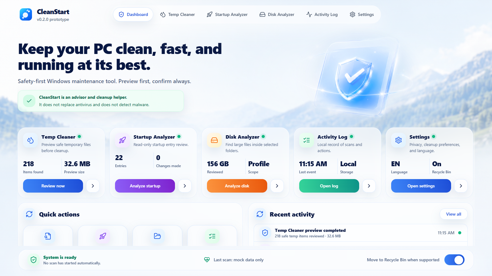

# CleanStart

CleanStart is a safety-first Windows maintenance app. The current public track is
moving from the legacy PyQt6 MVP to a new Tauri + React + TypeScript + Tailwind
desktop prototype.

## Why CleanStart Exists

Many cleanup tools use aggressive language, unclear deletion rules, or promises
they cannot honestly prove. CleanStart is built as a safer alternative: preview
first, explain what is being reviewed, require confirmation before real cleanup,
and avoid fake optimizer or antivirus claims.

## Current Version

- `v0.2.0-alpha`: Tauri + React + TypeScript + Tailwind UI prototype.
- `legacy-pyqt/`: preserved PyQt6 v0.1.0 MVP/reference implementation.

The v0.2.0 prototype uses mock data only. It does not run real cleanup, startup
changes, disk deletion, telemetry, login, analytics, cloud sync, or external
server calls.

## CleanStart v0.2.0-alpha UI prototype

CleanStart is being rewritten from the legacy PyQt desktop MVP to a new Tauri +
React + TypeScript + Tailwind desktop app. The current `v0.2.0-alpha` build is a
UI prototype that demonstrates the planned desktop experience, navigation,
Dashboard layout, reusable components, and safety-first product language.



This Tauri version is not a working cleaner yet. Real cleanup, startup analysis,
and disk analysis logic are not connected in `v0.2.0-alpha`; the screens use
mock/demo data so the UI can be reviewed safely before backend integration.

The prototype keeps the same safety boundaries as the project:

- No telemetry.
- No login or accounts.
- No cloud sync.
- No fake optimizer claims.
- No antivirus or malware-detection claims.
- No destructive cleanup logic connected yet.

## Features In The v0.2.0 Prototype

- Dashboard with premium light glassmorphism layout.
- Temp Cleaner screen with category chips, checkbox table, selection summary,
  and safety note.
- Startup Analyzer screen with search, read-only advisor table, and status
  badges.
- Disk Analyzer screen with storage breakdown mockup, folder scope message, and
  largest items table.
- Activity Log screen with filter chips, event list, and local-only messaging.
- Settings screen with language, privacy, Recycle Bin behavior, and about
  sections.
- Real React components for cards, buttons, toggles, tables, search, inspector
  panels, safety banners, and bottom status.

## Safety Principles

- No automatic scan on app startup.
- No destructive cleanup logic in the first Tauri prototype.
- No malware detection or antivirus claims.
- No fake speed boosts or scareware language.
- No login, telemetry, analytics, cloud sync, or external servers.
- Real cleanup must remain preview-first and confirmation-gated when connected
  later.

## Screenshots

Use `docs/screenshots/` for release screenshots and avoid exposing real
usernames, personal paths, or private files.

Planned screenshot set:

- Dashboard: `docs/screenshots/cleanstart-v0.2.0-alpha-dashboard.png`
- Temp Cleaner
- Startup Analyzer
- Disk Analyzer
- Activity Log
- Settings

## Requirements

- Node.js 20+ recommended.
- npm 10+.
- Rust/Cargo is required for the full Tauri desktop runtime.

This machine currently has Node/npm available, but Rust/Cargo must be installed
before `npm run tauri dev` can launch the desktop shell.

## Install

```powershell
git clone https://github.com/vladislavovicvlad10-spec/CleanStart.git
cd CleanStart
npm install
```

## Run The UI Prototype

Desktop development mode:

```powershell
npm run dev
```

This opens the CleanStart Tauri desktop window. It may also start a local Vite
dev server in the background, but you do not need to open it in a browser.

Frontend-only browser preview, only if you explicitly need it:

```powershell
npm run dev:web
```

Alternative explicit Tauri command:

```powershell
npm run tauri dev
```

## Build

Frontend build:

```powershell
npm run build
```

Tauri desktop build after installing Rust/Cargo:

```powershell
npm run tauri build
```

Windows helper script:

```powershell
.\scripts\build_windows.ps1
```

## Project Structure

```text
src/                 React + TypeScript UI prototype
src/components/      Reusable app shell and UI components
src/data/            Mock data for the prototype
src-tauri/           Tauri v2 desktop shell configuration
public/assets/       Allowed UI assets: background, hero, app logo
docs/                Screenshot notes and design references
legacy-pyqt/         Preserved PyQt6 v0.1.0 MVP/reference
```

## Roadmap

See [ROADMAP.md](ROADMAP.md). Future backend work should reconnect cleanup,
startup, and disk logic safely without changing the safety principles above.

## Contributing

See [CONTRIBUTING.md](CONTRIBUTING.md). For the Tauri prototype, keep UI
components real and interactive. Do not replace screens with static screenshots.
